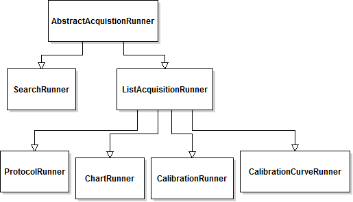

=================
Spikeylab API
=================

The program can be divided into two parts: 

* The GUI which interacts with the user to get inputs and presents results. Saves user input values.
* The back-end which takes inputs and communicates with hardware to present stimuli and record results. Holds all state information related to stimuli and data. Handles all data file operations. Can be run without the GUI interface, but designed to be used with it.

The top-level class for the buisness logic is :class:`AcquisitionManager<spikeylab.run.acquisition_manager>`. This class divvies up tasks it recieves from the Main UI class to the different acquisition runner modules.

The top-level class for the GUI is :class:`MainWindow<spikeylab.gui.control.MainWindow>`. To run this with a data file dialog (recommended) run the main method of :mod:`spikeylab.gui.control`.

Backend Structure
------------------
Runner classes
+++++++++++++++
The :class:`AcquisitionManager<spikeylab.run.acquisition_manager>` contains runner classes for the different types of data acquisition that the system is capable of. It also contains some shared state and resources between the different acqusition runner classes such as communication queues. Only one acqusition operation may be in progress at any time.

The different acquisition operations that the program runs are:

* Explore (a.k.a Search) mode, run by :class:`SearchRunner<spikeylab.run.search_runner.SearchRunner>`. Allows on going, on-the-fly, windowed, acquisition. I.e. the stimulus may be changed in the after acquistion has begun. Data gathered in this mode is not currently saved to file.
* Protocol (a.k.a Experimental) mode, run by :class:`ProtocolRunner<spikeylab.run.protocol_runner.ProtocolRunner>`. Allows for a pre-defined list of stimlui to be presented for windowed acquisition. Stimuli cannot be changed once acquisition has begun, although it may be interrupted and halted before finishing.
* Calibration mode, consists of two types a tone curve or a single stimulus which are run separately by :class:`CalibrationCurveRunner<spikeylab.run.calibration_runner.CalibrationCurveRunner>` and :class:`CalibrationRunner<spikeylab.run.calibration_runner.CalibrationRunner>` respectively. Both are predefined, windowed acquisition, for the purpose of speaker calibration, intended to be run before the start of any other operation, but may be run at any time.
* Chart mode, run by :class:`ChartRunner<spikeylab.run.chart_runner.ChartRunner>`. Allows for continuous, on going acqusition. For future development.

All of these runner classes share a common superclass :class:`AbstractAcquisitionRunner<spikeylab.run.abstract_acquisition.AbstractAcquisitionRunner>`:

Stimulus Classes
++++++++++++++++

The main container for an individual stimulus is the :class:`StimulusModel<spikeylab.stim.stimulusmodel>`. The stimulus is composed of a 2D array (nested lists) of components which are any subclass of :class:`AbstractStimulusComponent<spikeylab.stim.abstract_stimulus>`. These classes are required to implement a signal function, which is used by StimulusModel to sum its components to get the total signal for the desired stimulus. This allows for creation of any stimulus imaginable through the ability to overlap components, and to define custom component classes.

On its own, a StimulusModel represents a single stimlulus signal (the sum of it's components). To create auto-tests (automatic component manipulation, e.g. a tuning curve), The StimlulusModel uses the information held in its :class:`AutoParameterModel<spikeylab.stim.auto_parameter_model>` attribute to modify itself in a loop, and collect all the resultant signals, yielding a list of signals to generate.

Any number of StimulusModels can be collected in a list via a :class:`ProtocolModel<spikeylab.run.protocol_model>`, to be generated independent of each other, in sequence.

Visually, the hierarchy of Stimulus Assembly is as follows:

.. image:: stimulusUML.png

The list of StimlusModels inside of a ProtocolModel, and the list of Components inside of a SimulusModel can, in fact, be empty (and are upon initialization), but cannot be when run by a runner class; i.e. an empty stimulus is considered an error. 

Speaker Calibration
++++++++++++++++++++

This program uses a digital filter to compensate for high frequency speaker roll-off. A broad-spectrum control signal (frequency sweep) is generated and recorded back using :class:`CalibrationRunner<spikeylab.run.calibration_runner.CalibrationRunner>`, which also generates the system frequency response from this recorded signal.

The frequency response for the system is derived via :func:`attenuation_curve<spikeylab.tools.audiotools.attenuation_curve>` function. The result of this is also presented to the user as an 'attenuation curve'. This frequency response is saved to file, and can used later to generate a new filter kernel. 

The frequency response is given to the different acquisition runner classes which will pass it on to their :meth:`StimulusModel<spikeylab.stim.stimulusmodel.StimulusModel.setCalibration>`(s). The StimulusModel class uses the frequency response vector, together with a vector of respective frequencies, to generate a filter kernel using :func:`impulse_response<spikeylab.tools.audiotools.impulse_response>`. This is saved to be used against output stimulus signals.

Thus, after stimuli are prepared, but before they are generated, the StimulusModel applies the calibration to the signal by convolving the filter with the output signal using :func:`convolve_filter<spikeylab.tools.audiotools.convolve_filter>`.

To see the effect of a calibration, the calibration procedure, or the calibration curve that :class:`CalibrationCurveRunner<spikeylab.run.calibration_runner.CalibrationCurveRunner>` runs will a calibration vector in place, will show stimuli with thier component frequencies corrected. Of course, it is also possible to see this in search mode with any stimuli. When using the GUI, a special interface is provided to examine the outgoing and recorded signal. Note that the CalibrationCurveRunner is used for testing only, it does not save a calibration.

To compare calibration performance and effectiveness test scripts `calibration_performance.py` and `calibration_eval.py` generate tables to compare run times and error between desired and acheived output signals. These scripts can be found in the test/scripts project folder.

For a more in depth narrative on how this procedure was developed, see this post_, and especially this post__

.. _post: http://amyboyle.ninja/Calibrating-Ultrasonic-Speakers/
__ http://amyboyle.ninja/Calibrating-Ultrasonic-Speakers-Cont/

GUI Structure
-------------
The Qt_ framework was chosen to build the GUI for this project. The project was developed using the PyQt package for the Python bindings. The layout of the main GUI window, as well as dialogs and other pieces, were created using Qt Designer. This creates a XML file that can be used to automatically generate the python code using a script that comes with the PyQt package. This files have the extention .ui. The main UI class :class:`MainWindow<spikeylab.gui.control.MainWindow>` holds a reference to an :class:`AcquisitionManager<spikeylab.run.acquisition_manager>`, and the GUI gathers inputs from the user to feed to this main backend class. The Main GUI window mostly contains a lot of widgets that serve as editors for underlying stimuli classes or for plotting data. It also contains inputs to set the acquisition parameters, such as window size, samplerate, channel number, etc.

An example of a Qt class :qtdoc:`QAbstractItemView`

.. _Qt: http://qt-project.org/doc/qt-4.8

Stimulus widgets
+++++++++++++++++

To interface with the stimuli classes, this program makes use of the Qt Model-View classes to wrap around the native python objects. This is the case with 3 classes, our stimuli classes are wrapped by :class:`QProtocolTableModel<spikeylab.gui.qprotocol.QProtocolTableModel>`,
:class:`QStimulusModel<spikeylab.gui.stim.qstimulus.QStimulusModel>`, and :class:`QAutoParameterModel<spikeylab.gui.stim.qauto_parameter_model.QAutoParameterModel>`. Each of these models has a custom view, which inherits from a Qt view superclass, and also from :class:`AbstractDragView<spikeylab.gui.abstract_drag_view.AbstractDragView>`. This is to create some sort of continuity with the way the user interacts with the different parts of stimulus assembly.

.. image:: stimviewsUML.png

Plotting
+++++++++

The plotting is built upon the pyqtgraph_ library.

.. _pyqtgraph: http://www.pyqtgraph.org/documentation

Reference API
--------------

.. toctree::
   :maxdepth: 3

   auto/modules.rst
