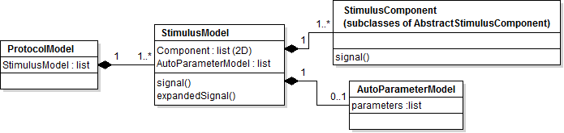
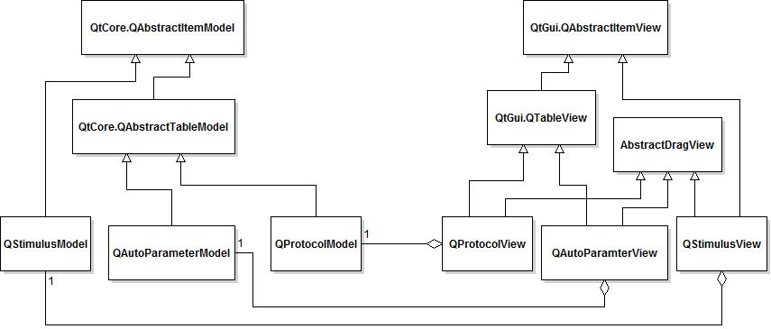

=================
Spikeylab API
=================

This document is intented for maintainers, and people who wish to expand Spikeylab. For a description of how I set up the development environment see :doc:`dev_env`

The program can be divided into two parts: 

* The GUI which interacts with the user to get inputs and presents results. Saves user input values.
* The back-end which takes inputs and communicates with hardware to present stimuli and record results. Holds all state information related to stimuli and data. Handles all data file operations. Can be run without the GUI interface, but designed to be used with it.

The top-level class for the buisness logic is :class:`AcquisitionManager<spikeylab.run.acquisition_manager>`. This class divvies up tasks it recieves from the Main UI class to the different acquisition runner modules.

The top-level class for the GUI is :class:`MainWindow<spikeylab.gui.control.MainWindow>`. To run this with a data file dialog (recommended) run the main method of :mod:`spikeylab.gui.run`.

Backend Structure
------------------

Runner classes
+++++++++++++++
The :class:`AcquisitionManager<spikeylab.run.acquisition_manager>` contains runner classes for the different types of data acquisition that the system is capable of. It also contains some shared state and resources between the different acqusition runner classes such as communication queues. Only one acqusition operation may be in progress at any time.

The different acquisition operations that the program runs are:

* Explore (a.k.a Search) mode, run by :class:`SearchRunner<spikeylab.run.search_runner.SearchRunner>`. Allows on going, on-the-fly, windowed, acquisition. I.e. the stimulus may be changed in the after acquistion has begun. Data gathered in this mode is not currently saved to file.
* Protocol (a.k.a Experimental) mode, run by :class:`ProtocolRunner<spikeylab.run.protocol_runner.ProtocolRunner>`. Allows for a pre-defined list of stimlui to be presented for windowed acquisition. Stimuli cannot be changed once acquisition has begun, although it may be interrupted and halted before finishing.
* Calibration mode, consists of two types: a tone curve, or a single stimulus, which are run separately by :class:`CalibrationCurveRunner<spikeylab.run.calibration_runner.CalibrationCurveRunner>` and :class:`CalibrationRunner<spikeylab.run.calibration_runner.CalibrationRunner>` respectively. Both are predefined, windowed acquisition, for the purpose of speaker calibration, intended to be run before the start of any other operation, but may be run at any time. Also associated is microphone calibration which is run by :class:`MphoneCalibrationRunner<spikeylab.run.microphone_calibration_runner.MphoneCalibrationRunner>`.
* Chart mode, run by :class:`ChartRunner<spikeylab.run.chart_runner.ChartRunner>`. Allows for continuous, on-going, acqusition. For future development.

All of these runner classes share a common superclass :class:`AbstractAcquisitionRunner<spikeylab.run.abstract_acquisition.AbstractAcquisitionRunner>`:

.. inheritance-diagram:: spikeylab.run.protocol_runner spikeylab.run.chart_runner spikeylab.run.calibration_runner spikeylab.run.search_runner spikeylab.run.microphone_calibration_runner
   :parts: 1

Hardware Communication
++++++++++++++++++++++

This application was built using National Instruments (NI) hardware and drivers. Specifically, the PCI-6259 and the daqmx drivers in ANSI C along with the PyDAQmx_ package to interface the drivers with python.

Custom :mod:`task classes<spikeylab.acq.daq_tasks>` exist for calling the NI drivers, these classes are based off of the C examples provided by NI.

Higher level :mod:`player classes<spikeylab.acq.players>` faciliate the repetitive and windowed nature of the recording this program is intended to execute. That said, continuous acquisition is also a goal, and there is a separate player class for this type of task.

NI provides simulated devices so that it is possible to develop applications without needing the actual hardware connected to the computer. However, this is only for the windows platform, so the module :mod:`daqmx_stub<spikeylab.acq.daqmx_stub>` stands in to allow development on the rest of the program without errors being thrown.

.. _PyDAQmx: https://pythonhosted.org/PyDAQmx/

Stimulus Classes
++++++++++++++++

The main container for an individual stimulus is the :class:`StimulusModel<spikeylab.stim.stimulus_model>`. Internally, the stimulus is composed of a 2D array (nested lists) of components which are any subclass of :class:`AbstractStimulusComponent<spikeylab.stim.abstract_component>`. These classes are required to implement a `signal` function (not to be confused with signals/slots of Qt), which is used by StimulusModel to sum its components to get the total signal for the desired stimulus. This allows for creation of any stimulus imaginable through the ability to overlap components, and to define custom component classes.

On its own, a StimulusModel represents a single stimlulus signal (the sum of it's components). To create auto-tests (automatic component manipulation, e.g. a tuning curve), The StimlulusModel uses the information held in its :class:`AutoParameterModel<spikeylab.stim.auto_parameter_model>` attribute to modify itself in a loop, and collect all the resultant signals, yielding a list of signals to generate.

Any number of StimulusModels can be collected in a list via a :class:`ProtocolModel<spikeylab.run.protocol_model>`, to be generated independent of each other, in sequence.

Visually, the hierarchy of Stimulus Assembly is as follows:

The list of StimlusModels inside of a ProtocolModel, and the list of Components inside of a SimulusModel can, in fact, be empty (and are upon initialization), but cannot be when run by a runner class; i.e. an empty stimulus is considered an error. 

Discovery of the stimulus components classes, by the UI, is automatic, with the intention to make it easier to add new component classes. The modules under the source folder `spikeylab/stim/types` are searched for subclasses of :code:`AbstractStimulusComponent`. Depending on flags set in each class, the component class will be pulled in to be available for explore, protocol or both operations by the UI.

For further information related to adding additional Stimulus Component classes see :doc:`Extending spikey<extending>`

Speaker Calibration
++++++++++++++++++++

This program uses a digital filter to compensate for high frequency speaker roll-off. A broad-spectrum control signal (frequency sweep) is generated and recorded back using :class:`CalibrationRunner<spikeylab.run.calibration_runner.CalibrationRunner>`, which also generates the system frequency response from this recorded signal.

The frequency response for the system is derived via :func:`attenuation_curve<spikeylab.tools.audiotools.attenuation_curve>` function. The result of this is also presented to the user as an 'attenuation curve'. This frequency response is saved to file, and can be used later to generate a new filter kernel. 

The frequency response is given to the different acquisition runner classes which will pass it on to their :meth:`StimulusModel<spikeylab.stim.stimulus_model.StimulusModel.setCalibration>`. The StimulusModel class uses the frequency response vector, together with a vector of respective frequencies, to generate a filter kernel using :func:`impulse_response<spikeylab.tools.audiotools.impulse_response>`. This is saved to be used against output stimulus signals. This step is done in each `StimulusModel` class, and not more globally like the attenuation curve, becuase the filter kernel will need to be regenerated depending on output sample rate, and this may change between stimulus instances.

Thus, after stimuli are prepared, but before they are generated, the StimulusModel applies the calibration to the signal by convolving the filter with the output signal using :func:`convolve_filter<spikeylab.tools.audiotools.convolve_filter>`.

To see the effect of a calibration, the calibration procedure, or the calibration curve that :class:`CalibrationCurveRunner<spikeylab.run.calibration_runner.CalibrationCurveRunner>` runs will a calibration vector in place, will show stimuli with thier component frequencies corrected. Of course, it is also possible to see this in search mode with any stimuli. When using the GUI, a special interface is provided to examine the outgoing and recorded signal. Note that the CalibrationCurveRunner is used for testing only, it does not save a calibration.

To compare calibration performance and effectiveness test scripts `calibration_performance.py` and `calibration_eval.py` generate tables to compare run times and error between desired and acheived output signals. These scripts can be found in the test/scripts project folder.

For a more in depth narrative on how this procedure was developed, see this post_, and especially this post__

There are scripts that were used in aid of evaluating the calibration procedure that can be found in the source under *test/scripts*:

    * `calibration_eval.py` : Compares the efficacy of the calibration with varying parameters, such as filter length or smoothing points

    * `calibration_performance.py` : Compares the execution time taken primarily for differing filter length

    * `hardware_attenuation.py` : This simple script just compares the output signal to the input to determine amplitude loss across pure tone frequencies. Intended to be used so that we may determine the signal loss from a signal piece of harware such as an attenuator or amplifier. Another way to investigate this is to analyze the output vs input of a FM sweep signal.

Filter length turned out to be the most influential factor on both filter effectiveness and performance. It is possible to choose a filter length that executes in a shorter amount of time, that still has very good ability to properly adjust signals.

.. _post: http://amyboyle.ninja/Calibrating-Ultrasonic-Speakers/
__ http://amyboyle.ninja/Calibrating-Ultrasonic-Speakers-Cont/

GUI Structure
-------------
The Qt_ framework was chosen to build the GUI for this project. The project was developed using the PyQt package for the Python bindings. The layout of the main GUI window, as well as dialogs and other pieces, were created using Qt Designer. This creates a XML file that can be used to automatically generate the python code using a script that comes with the PyQt package. These files have the extention .ui. By convention, all the auto-generated python UI files end in "_form.py". The main UI class :class:`MainWindow<spikeylab.gui.control.MainWindow>` holds a reference to an :class:`AcquisitionManager<spikeylab.run.acquisition_manager>`, and the GUI gathers inputs from the user to feed to this main backend class. The Main GUI window mostly contains a lot of widgets that serve as editors for underlying stimuli classes or for plotting data. It also contains inputs to set the acquisition parameters, such as window size, samplerate, channel number, etc.

The views noted above are often contained in editor widgets. There is also an inheritance hierarchy for these editor widgets. (Discussed in the next section)

.. _Qt: http://qt-project.org/doc/qt-4.8

Stimulus widgets
+++++++++++++++++

To interface with the stimuli classes, this program makes use of the Qt Model-View classes to wrap around the native python objects. This is the case with 4 classes, our stimuli classes are wrapped by :class:`QProtocolTableModel<spikeylab.gui.qprotocol.QProtocolTabelModel>`,
:class:`QStimulusModel<spikeylab.gui.stim.qstimulus.QStimulusModel>`, :class:`QStimulusComponent<spikeylab.gui.stim.components.qcomponents.QStimulusComponent>`, and :class:`QAutoParameterModel<spikeylab.gui.stim.qauto_parameter_model.QAutoParameterModel>`. Each of these models (except components) has a custom view, which inherits from a Qt view superclass, and also from :class:`AbstractDragView<spikeylab.gui.abstract_drag_view.AbstractDragView>` (Note that this is multiple inheritance). This is to create some sort of continuity with the way the user interacts with the different parts of stimulus assembly. That being said, a view may not always be used; sometimes a simplified editor widget is used to provide a short-cut for certain types of stimulus assembly, such as a tuning curve.

Components each have their own editor widgets, which must be subclasses of :class:`AbstractComponentWidget<spikeylab.gui.stim.abstract_component_editor>`. Which editor to use is supplied by the wrapper class for that Stimulus class, e.g. A ``Vocalization`` component class has a ``QVocalization`` wrapper class that has a ``showEditor`` method that will return an editor widget appropriate for that component type. A generic default editor is generated for component classes that does not have a wrapper provided, or if the wrapper class does not re-implement the ``showEditor`` method from base class ``QStimulusComponent``.

All parts of the stimulus assembly have 1 or more editor widgets that can be used to manipulate the data model, these editor widgets may contain the views mentioned above. All editor widgets are a subclass of the base :class:`AbstractEditorWidget<spikeylab.gui.stim.abstract_editor>`.

.. inheritance-diagram:: spikeylab.gui.stim.tuning_curve spikeylab.gui.stim.stimulus_editor spikeylab.gui.stim.explore_stim_editor.ExploreStimulusEditor spikeylab.gui.stim.generic_parameters spikeylab.gui.stim.components.vocal_parameters spikeylab.gui.stim.explore_component_editor
    :parts: 1

Plotting
+++++++++

The plotting is built upon the pyqtgraph_ library. All custom plots widgets are subclassed from :class:`BasePlot<spikeylab.gui.plotting.pyqtgraph_widgets.BasePlot>`. An important consequence of this is that custom mouse behaviour is the same across all plot widgets. Each plot widget in this package presents the data in a way that is appropriate for that data.

The plot widgets are arranged into displays: 

    * :class:`ProtocolDisplay<spikeylab.gui.plotting.protocoldisplay.ProtocolDisplay>`: Main display for visualizing the the auditory stimulus and brain recording. Stimulus is shown in spectrogram, time signal, and FFT plots. Brain recording trace includes a raster plot of spike detection, which has an adjustable threshold.
    * :class:`CalibrationDisplay<spikeylab.gui.plotting.calibration_display.CalibrationDisplay>` : Has two plots that show the generated and recorded signals as FFT plots.
    * :class:`ExtendedCalibrationDisplay<spikeylab.gui.plotting.calibration_explore_display.ExtendedCalibrationDisplay>` : Shows the generated and recorded signals each as a spectrogram, time signal and FFT plot.

All of the display widgets separate their component plot widgets using QSplitters.

.. _pyqtgraph: http://www.pyqtgraph.org/documentation

Logging
-------

This program uses the python :py:mod:`logging` module. The logging configuration is found in the source at `spikeylab/tools/logging.conf`. A custom handler was built to make log messages available to the user through a Qt :class:`widget<spikeylab.tools.uihandler.TextEditHandler>`. Logs should also be saved to file, as an extra measure of documentation for experiments, and debugging the program after active use.

Testing
--------
Everying that can be tested, should be tested. There is a testing utility package, originally wrote for this project, but that has been split off, qtbot_. This package simulates user interaction with the GUI, to allow for testing GUI components themselves, and that the appropriate results from using them happen. New functionality should be accompanied by tests.

.. _qtbot : https://github.com/boylea/qtbot

Documentation
-------------
This documentation was built using Sphinx_, which uses reStructuredText to generate HTML pages. To build this documentation, go to the *doc* directory and run `make html`. Any time a change is made to the source code, it should be made sure that the documentation, including the docstrings, API reference, and user guide, is up to date in the same commit. General improvements to the documentation are always welcome.

.. _Sphinx: http://sphinx-doc.org/index.html

Extending
---------

See :doc:`Extending spikey<extending>`

Reference API
-------------

.. toctree::
   :maxdepth: 3

   auto/spikeylab.rst
